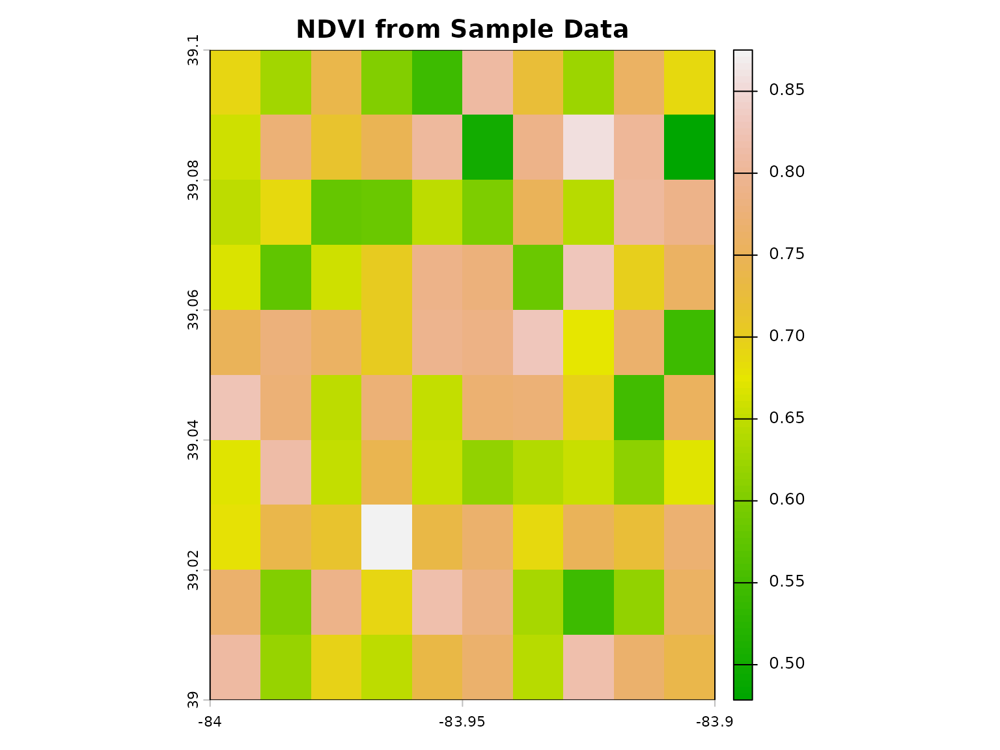
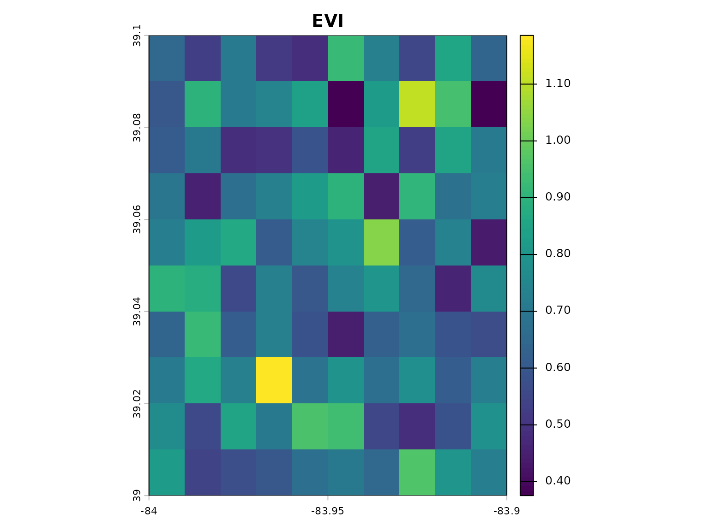
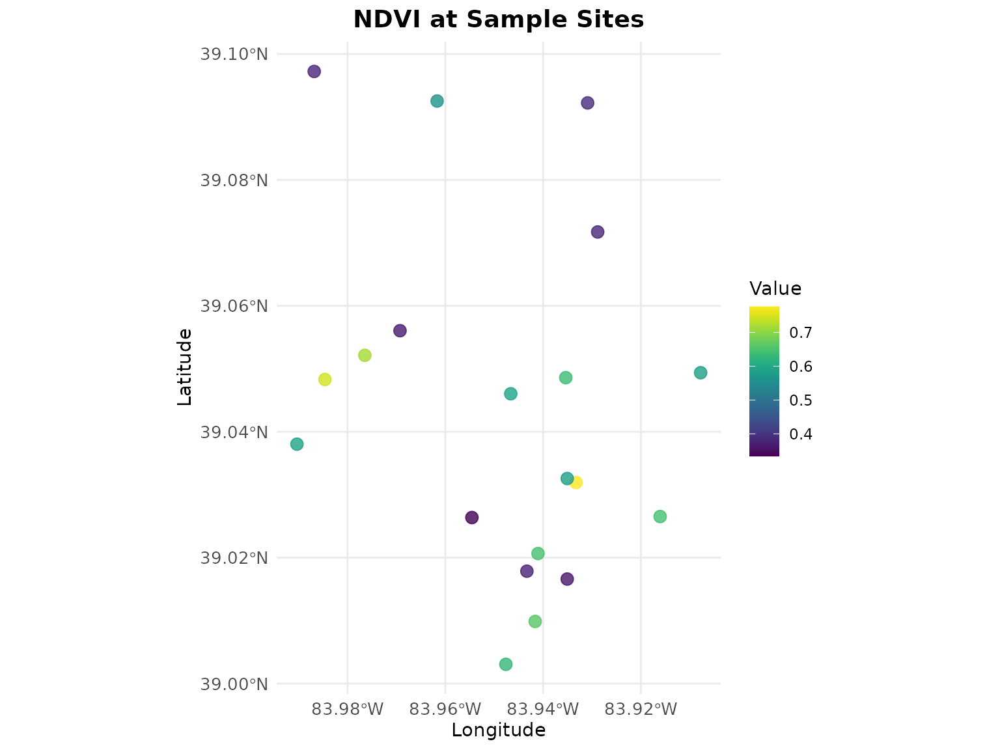

# Getting Started with geospatialsuite

## Introduction

geospatialsuite is a comprehensive R package for geospatial analysis and
visualization. It provides universal functions that work with any
region, robust error handling, and simplified workflows for complex
spatial analysis tasks.

### Key Features

- **60+ vegetation indices** with automatic band detection
- **Universal spatial mapping** with one-line functionality
- **Reliable terra-based visualization** without complex dependencies
- **Agricultural applications** including CDL crop analysis
- **Water quality assessment** with multiple indices
- **Robust error handling** throughout all functions
- **Built-in sample data** for learning and testing
- **Flexible data loading** from files, directories, or objects

### Installation

``` r
# Install from CRAN
install.packages("geospatialsuite")
```

``` r
# Load the package
library(geospatialsuite)
library(terra)
```

### Quick Start with Built-in Sample Data

geospatialsuite includes built-in sample data so you can start
immediately:

``` r
library(geospatialsuite)
library(terra)

# List available sample datasets
list_sample_datasets()
#>                 filename       type size_kb
#> 1         sample_red.rds SpatRaster       2
#> 2         sample_nir.rds SpatRaster       2
#> 3        sample_blue.rds SpatRaster       2
#> 4       sample_green.rds SpatRaster       2
#> 5       sample_swir1.rds SpatRaster       2
#> 6   sample_multiband.rds SpatRaster       8
#> 7      sample_points.rds         sf       3
#> 8    sample_boundary.rds         sf       2
#> 9 sample_coordinates.csv data.frame       1
#>                                          description
#> 1   Red band reflectance (10x10 pixels, Ohio region)
#> 2   NIR band reflectance (10x10 pixels, Ohio region)
#> 3  Blue band reflectance (10x10 pixels, Ohio region)
#> 4 Green band reflectance (10x10 pixels, Ohio region)
#> 5 SWIR1 band reflectance (10x10 pixels, Ohio region)
#> 6   Multi-band raster (Blue, Green, Red, NIR, SWIR1)
#> 7 Sample field locations (20 points with attributes)
#> 8                 Sample study area boundary polygon
#> 9    Sample coordinates with elevation and soil data
#>                                          use_case available
#> 1 Vegetation index calculation (NDVI, SAVI, etc.)      TRUE
#> 2 Vegetation index calculation (NDVI, SAVI, etc.)      TRUE
#> 3     Enhanced vegetation index (EVI) calculation      TRUE
#> 4           Water index calculation (NDWI, GNDVI)      TRUE
#> 5        Water and moisture indices (NDMI, MNDWI)      TRUE
#> 6    Auto band detection, multi-index calculation      TRUE
#> 7     Spatial join examples, extraction workflows      TRUE
#> 8    Region boundary examples, masking operations      TRUE
#> 9         Geocoding, spatial integration examples      TRUE
#>                                access_method
#> 1         load_sample_data('sample_red.rds')
#> 2         load_sample_data('sample_nir.rds')
#> 3        load_sample_data('sample_blue.rds')
#> 4       load_sample_data('sample_green.rds')
#> 5       load_sample_data('sample_swir1.rds')
#> 6   load_sample_data('sample_multiband.rds')
#> 7      load_sample_data('sample_points.rds')
#> 8    load_sample_data('sample_boundary.rds')
#> 9 load_sample_data('sample_coordinates.csv')

# Load sample raster data
red <- load_sample_data("sample_red.rds")
nir <- load_sample_data("sample_nir.rds")

# Calculate NDVI
ndvi <- calculate_vegetation_index(red = red, nir = nir, index_type = "NDVI")

# Visualize
plot(ndvi, main = "NDVI from Sample Data", col = terrain.colors(100))
```



### Core Workflows

#### 1. Calculate Vegetation Indices

``` r
# Load sample spectral bands
red <- load_sample_data("sample_red.rds")
nir <- load_sample_data("sample_nir.rds")
blue <- load_sample_data("sample_blue.rds")

# Calculate NDVI
ndvi <- calculate_vegetation_index(red = red, nir = nir, index_type = "NDVI")
plot(ndvi, main = "NDVI")
```


``` r

# Calculate EVI (requires blue band)
evi <- calculate_vegetation_index(red = red, nir = nir, blue = blue, index_type = "EVI")
plot(evi, main = "EVI")
```



``` r

# Calculate multiple indices at once
indices <- calculate_multiple_indices(
  red = red,
  nir = nir,
  blue = blue,
  indices = c("NDVI", "EVI", "SAVI"),
  output_stack = TRUE
)

# Plot all indices
plot(indices)
```


#### 2. Working with Multi-band Data

``` r
# Load multi-band sample raster
multiband <- load_sample_data("sample_multiband.rds")

# Check band names
names(multiband)
#> [1] "blue"  "green" "red"   "nir"   "swir1"

# Auto-detect bands and calculate index
ndvi_auto <- calculate_vegetation_index(
  spectral_data = multiband,
  index_type = "NDVI",
  auto_detect_bands = TRUE
)
```

#### 3. Spatial Operations

``` r
# Load sample vector data
points <- load_sample_data("sample_points.rds")
boundary <- load_sample_data("sample_boundary.rds")

# Calculate NDVI
red <- load_sample_data("sample_red.rds")
nir <- load_sample_data("sample_nir.rds")
ndvi <- calculate_vegetation_index(red = red, nir = nir, index_type = "NDVI")

# Extract raster values to points
points_with_values <- universal_spatial_join(
  source_data = points,
  target_data = ndvi,
  method = "extract"
)

# Check result
head(points_with_values)
#> Simple feature collection with 6 features and 7 fields
#> Geometry type: POINT
#> Dimension:     XY
#> Bounding box:  xmin: -83.94662 ymin: 39.00987 xmax: -83.91607 ymax: 39.09223
#> Geodetic CRS:  WGS 84
#>   site_id  ndvi   evi crop_type elevation_m soil_moisture
#> 1 SITE_01 0.593 0.274  soybeans         269          0.27
#> 2 SITE_02 0.660 0.485     wheat         283          0.28
#> 3 SITE_03 0.646 0.579      corn         211          0.21
#> 4 SITE_04 0.388 0.483   pasture         256          0.31
#> 5 SITE_05 0.776 0.588      corn         219          0.35
#> 6 SITE_06 0.645 0.539  soybeans         205          0.30
#>                     geometry extracted_NDVI
#> 1 POINT (-83.94662 39.04604)      0.7709993
#> 2 POINT (-83.94162 39.00987)      0.7667765
#> 3 POINT (-83.94104 39.02066)      0.7647660
#> 4  POINT (-83.9309 39.09223)      0.7207893
#> 5 POINT (-83.93327 39.03194)      0.6405917
#> 6 POINT (-83.91607 39.02653)      0.7215534
```

#### 4. Data Visualization

``` r
# Load sample data
points <- load_sample_data("sample_points.rds")

# Quick map (auto-detects everything)
quick_map(points, variable = "ndvi", title = "NDVI at Sample Sites")
```



### Available Sample Datasets

``` r
# List all available datasets
datasets <- list_sample_datasets()
print(datasets[, c("filename", "type", "description")])
#>                 filename       type
#> 1         sample_red.rds SpatRaster
#> 2         sample_nir.rds SpatRaster
#> 3        sample_blue.rds SpatRaster
#> 4       sample_green.rds SpatRaster
#> 5       sample_swir1.rds SpatRaster
#> 6   sample_multiband.rds SpatRaster
#> 7      sample_points.rds         sf
#> 8    sample_boundary.rds         sf
#> 9 sample_coordinates.csv data.frame
#>                                          description
#> 1   Red band reflectance (10x10 pixels, Ohio region)
#> 2   NIR band reflectance (10x10 pixels, Ohio region)
#> 3  Blue band reflectance (10x10 pixels, Ohio region)
#> 4 Green band reflectance (10x10 pixels, Ohio region)
#> 5 SWIR1 band reflectance (10x10 pixels, Ohio region)
#> 6   Multi-band raster (Blue, Green, Red, NIR, SWIR1)
#> 7 Sample field locations (20 points with attributes)
#> 8                 Sample study area boundary polygon
#> 9    Sample coordinates with elevation and soil data
```

**Sample datasets include:**

- `sample_red.rds` - Red band SpatRaster (10×10 pixels)
- `sample_nir.rds` - NIR band SpatRaster
- `sample_blue.rds` - Blue band SpatRaster
- `sample_green.rds` - Green band SpatRaster
- `sample_swir1.rds` - SWIR1 band SpatRaster
- `sample_multiband.rds` - Multi-band stack (5 bands)
- `sample_points.rds` - Sample field locations (sf object)
- `sample_boundary.rds` - Study area polygon (sf object)
- `sample_coordinates.csv` - Tabular data with coordinates

------------------------------------------------------------------------

## Working with Your Own Data

### Loading Raster Files with geospatialsuite

#### Single GeoTIFF File

``` r
# Use geospatialsuite's load_raster_data() function
# It provides robust error handling and validation

# Load a single .tif file
my_raster <- load_raster_data("path/to/your/ndvi.tif")

# Result is a list, extract the raster
ndvi_raster <- my_raster[[1]]

# Now use with geospatialsuite functions
# The raster is ready for analysis
summary(ndvi_raster)
```

#### Multiple GeoTIFF Files

``` r
# Load multiple Landsat bands with geospatialsuite
# Handles validation automatically

landsat_files <- c(
  "LC08_B4_red.tif",
  "LC08_B5_nir.tif",
  "LC08_B3_green.tif"
)

# geospatialsuite loads them with error checking
bands <- load_raster_data(landsat_files, verbose = TRUE)

# Extract individual bands
red_band <- bands[[1]]
nir_band <- bands[[2]]
green_band <- bands[[3]]

# Calculate indices using geospatialsuite
ndvi <- calculate_vegetation_index(
  red = red_band,
  nir = nir_band,
  index_type = "NDVI"
)

gndvi <- calculate_vegetation_index(
  green = green_band,
  nir = nir_band,
  index_type = "GNDVI"
)
```

#### Load from Directory

``` r
# geospatialsuite can load all rasters from a directory
# Perfect for batch processing

# Load all .tif files from Landsat directory
all_bands <- load_raster_data(
  "/path/to/landsat/imagery/",
  pattern = "\\.(tif|tiff)$",
  verbose = TRUE
)

# geospatialsuite finds, loads, and validates all files
# Returns a list of SpatRaster objects ready to use
cat("Loaded", length(all_bands), "raster files\n")
```

### Real-World Landsat Workflow

``` r
# Complete workflow using geospatialsuite functions

library(geospatialsuite)

# 1. Load Landsat bands using geospatialsuite
landsat_bands <- load_raster_data(
  "landsat/LC08_L2SP_021033_20240715/",
  pattern = "SR_B[2-5].TIF$",
  verbose = TRUE
)

# geospatialsuite loaded them with validation
# Extract bands (scaled values 0-1 after Collection 2 scaling)
blue <- landsat_bands[[1]]   # After scaling
green <- landsat_bands[[2]]
red <- landsat_bands[[3]]
nir <- landsat_bands[[4]]

# 2. Calculate vegetation indices using geospatialsuite
# The package has 60+ pre-programmed indices
veg_indices <- calculate_multiple_indices(
  red = red,
  nir = nir,
  blue = blue,
  green = green,
  indices = c("NDVI", "EVI", "SAVI", "GNDVI"),
  output_stack = TRUE
)

# 3. Visualize using geospatialsuite
quick_map(veg_indices$NDVI, title = "Landsat 8 NDVI - July 15, 2024")
```

### Working with Vector Data

#### Loading Shapefiles

``` r
# Load shapefile with sf (standard approach)
library(sf)
field_boundaries <- sf::st_read("data/farm_fields.shp")

# Then use with geospatialsuite's spatial functions
# Calculate NDVI first
ndvi <- calculate_vegetation_index(red = red, nir = nir, index_type = "NDVI")

# Extract NDVI to field boundaries using geospatialsuite
fields_with_ndvi <- universal_spatial_join(
  source_data = field_boundaries,
  target_data = ndvi,
  method = "extract"
)

# geospatialsuite handles CRS mismatches automatically
# Returns field boundaries with extracted NDVI statistics
head(fields_with_ndvi)
```

#### Working with GeoPackages

``` r
# Load GeoPackage (modern format, better than shapefile)
farm_data <- sf::st_read("farm_management.gpkg", layer = "fields")
sample_points <- sf::st_read("farm_management.gpkg", layer = "samples")

# Use geospatialsuite's spatial join
samples_with_indices <- universal_spatial_join(
  source_data = sample_points,
  target_data = veg_indices,
  method = "extract",
  buffer_distance = 30  # 30m buffer
)

# geospatialsuite extracted all indices in the stack
# Each index becomes a column in the result
names(samples_with_indices)
```

### Multi-band Raster with Auto-Detection

``` r
# geospatialsuite's auto-detection feature

# Load a stacked multi-band GeoTIFF
multiband_raster <- load_raster_data("sentinel2_stack.tif")[[1]]

# Name the bands (Sentinel-2 example)
names(multiband_raster) <- c("blue", "green", "red", "nir", "swir1")

# Use geospatialsuite's auto-detection
# It finds the right bands automatically!
indices <- calculate_multiple_indices(
  spectral_data = multiband_raster,
  indices = c("NDVI", "EVI", "MNDWI"),
  auto_detect_bands = TRUE,  # This is geospatialsuite's feature!
  output_stack = TRUE
)

# No need to specify which band is which
# geospatialsuite figured it out!
```

### Complete Real-World Example

``` r
# End-to-end agricultural monitoring with geospatialsuite

library(geospatialsuite)
library(sf)

# 1. Load satellite imagery using geospatialsuite
spectral_bands <- load_raster_data(
  "/path/to/satellite/bands/",
  pattern = "B[0-9].tif$",
  verbose = TRUE
)

# 2. Extract bands
red <- spectral_bands[[3]]
nir <- spectral_bands[[4]]
green <- spectral_bands[[2]]

# 3. Calculate indices using geospatialsuite
crop_health <- calculate_multiple_indices(
  red = red,
  nir = nir,
  green = green,
  indices = c("NDVI", "GNDVI", "SAVI"),
  output_stack = TRUE
)

# 4. Load field data
fields <- sf::st_read("farm_data/fields.shp")

# 5. Extract to fields using geospatialsuite
fields_analysis <- universal_spatial_join(
  source_data = fields,
  target_data = crop_health,
  method = "extract"
)

# 6. Visualize using geospatialsuite
quick_map(fields_analysis, 
          variable = "NDVI",
          title = "Field Health Assessment")

# geospatialsuite handled:
# - Loading multiple files
# - Calculating indices
# - Spatial extraction with CRS handling
# - Visualization
```

### Listing Available Indices

``` r
# See all vegetation indices geospatialsuite provides
veg_indices <- list_vegetation_indices()
head(veg_indices[, c("Index", "Category", "Description")])
#>   Index Category                              Description
#> 1  NDVI    basic   Normalized Difference Vegetation Index
#> 2  SAVI    basic           Soil Adjusted Vegetation Index
#> 3 MSAVI    basic  Modified Soil Adjusted Vegetation Index
#> 4 OSAVI    basic Optimized Soil Adjusted Vegetation Index
#> 5   EVI    basic                Enhanced Vegetation Index
#> 6  EVI2    basic       Two-band Enhanced Vegetation Index

# See water indices
water_indices <- list_water_indices()
head(water_indices)
#>   Index                Type Required_Bands Primary_Application
#> 1  NDWI     Water Detection     Green, NIR     water_detection
#> 2 MNDWI     Water Detection   Green, SWIR1     water_detection
#> 3  NDMI Vegetation Moisture     NIR, SWIR1 moisture_monitoring
#> 4   MSI     Moisture Stress     NIR, SWIR1  drought_assessment
#> 5  NDII Vegetation Moisture     NIR, SWIR1 moisture_monitoring
#> 6    WI       Water Content     NIR, SWIR1 moisture_monitoring
#>                                                                           Description
#> 1 Normalized Difference Water Index (McFeeters 1996) - Original water detection index
#> 2 Modified NDWI (Xu 2006) - Enhanced water detection, reduces built-up area confusion
#> 3          Normalized Difference Moisture Index (Gao 1996) - Vegetation water content
#> 4        Moisture Stress Index - Plant water stress detection (lower = more moisture)
#> 5     Normalized Difference Infrared Index - Alternative name for vegetation moisture
#> 6                             Water Index - Simple ratio for water content assessment
#>   Value_Range  Water_Threshold          Reference
#> 1     [-1, 1]            > 0.3   McFeeters (1996)
#> 2     [-1, 1]            > 0.5          Xu (2006)
#> 3     [-1, 1] N/A (vegetation)         Gao (1996)
#> 4    [0, 10+]            < 1.0            Various
#> 5     [-1, 1] N/A (vegetation) Hunt & Rock (1989)
#> 6    [0, 10+]            > 1.0            Various
```

### Getting Help

``` r
# Package documentation
help(package = "geospatialsuite")

# Function help
?calculate_vegetation_index
?load_raster_data
?universal_spatial_join
?quick_map
```

``` r
# Test package installation
test_geospatialsuite_package_simple()
```


    #> $test_results
    #> $test_results$basic_ndvi_test
    #> [1] TRUE
    #> 
    #> $test_results$water_index_test
    #> [1] TRUE
    #> 
    #> $test_results$basic_visualization_test
    #> [1] TRUE
    #> 
    #> $test_results$multiple_indices_simple_test
    #> [1] TRUE
    #> 
    #> $test_results$enhanced_ndvi_simple_test
    #> [1] TRUE
    #> 
    #> $test_results$dependencies_test
    #> [1] TRUE
    #> 
    #> $test_results$spatial_operations_test
    #> [1] TRUE
    #> 
    #> $test_results$data_loading_test
    #> [1] TRUE
    #> 
    #> 
    #> $summary
    #> $summary$total_tests
    #> [1] 8
    #> 
    #> $summary$passed_tests
    #> [1] 8
    #> 
    #> $summary$failed_tests
    #> [1] 0
    #> 
    #> $summary$success_rate
    #> [1] 100
    #> 
    #> $summary$duration_seconds
    #> [1] 0.31
    #> 
    #> $summary$version
    #> [1] "0.1.0"
    #> 
    #> 
    #> $test_output_dir
    #> [1] "/tmp/Rtmp5LM8fw"
    #> 
    #> $timestamp
    #> [1] "2026-01-01 18:41:48 EST"
    #> 
    #> $test_approach
    #> [1] "simplified_robust"
    #> 
    #> $core_message
    #> [1] "Focused on essential functionality with minimal complexity"

### Summary

geospatialsuite provides:

**Data Loading:**

- [`load_raster_data()`](https://exelegch.github.io/geospatialsuite-docs/reference/load_raster_data.md) -
  Load .tif files with validation
- [`load_sample_data()`](https://exelegch.github.io/geospatialsuite-docs/reference/load_sample_data.md) -
  Access built-in samples

**Analysis:**

- [`calculate_vegetation_index()`](https://exelegch.github.io/geospatialsuite-docs/reference/calculate_vegetation_index.md) -
  60+ indices
- [`calculate_multiple_indices()`](https://exelegch.github.io/geospatialsuite-docs/reference/calculate_multiple_indices.md) -
  Batch processing
- Auto band detection feature

**Spatial Operations:**

- [`universal_spatial_join()`](https://exelegch.github.io/geospatialsuite-docs/reference/universal_spatial_join.md) -
  Extract values, automatic CRS handling

**Visualization:**

- [`quick_map()`](https://exelegch.github.io/geospatialsuite-docs/reference/quick_map.md) -
  One-line mapping
- [`create_spatial_map()`](https://exelegch.github.io/geospatialsuite-docs/reference/create_spatial_map.md) -
  Custom maps

All with robust error handling and simplified workflows!

------------------------------------------------------------------------

**For more detailed tutorials, see the other vignettes:**

- Vegetation Indices Analysis
- Agricultural Applications
- Spatial Analysis and Integration
- Water Quality Assessment
- Complete Workflows and Case Studies
