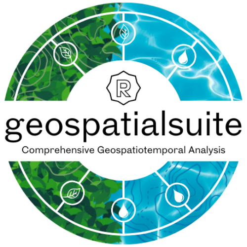

# geospatialsuite 🌍



> **Comprehensive Geospatiotemporal Analysis and Multimodal Integration
> Toolkit for R**

geospatialsuite is a powerful R package for geospatial analysis
featuring **60+ vegetation indices**, **universal spatial analysis**,
**auto-geocoding without coordinates**, **efficient raster
visualization**, and **comprehensive workflows** for agricultural
research, environmental monitoring, and remote sensing applications.

## 📋 Table of Contents

- [Key Features](#id_-key-features)
- [Quick Links](#id_-quick-links)
- [Installation](#id_-installation)
- [Quick Start](#id_-quick-start)
- [Auto-Geocoding](#id_-auto-geocoding-without-coordinates)
- [Documentation](#id_-documentation)
- [Real-World Examples](#id_-real-world-examples)
- [What Makes geospatialsuite
  Special](#id_-what-makes-geospatialsuite-special)
- [Supported Vegetation Indices](#id_-supported-vegetation-indices)
- [Performance](#id_-performance)
- [System Requirements](#id_-system-requirements)
- [Citation](#id_-citation)
- [Contact](#id_-contact)
- [License](#id_-license)
- [Acknowledgments](#id_-acknowledgments)

## 🔗 Quick Links

- **CRAN**: <https://cran.r-project.org/package=geospatialsuite>
- **GitHub**: <https://github.com/cwru-sdle/geospatialsuite>
- **Bug Reports**: <https://github.com/cwru-sdle/geospatialsuite/issues>

## ✨ Key Features

### 🗺️ **Auto-Geocoding Without Coordinates** ⭐ NEW!

- **Work with data that has NO lat/lon!** Automatically geocode using
  geographic identifiers
- **States**: Full names or abbreviations (e.g., “Ohio”, “OH”)
- **Counties**: County names with or without state
- **FIPS codes**: 5-digit Federal codes
- **HUC codes**: Watershed codes (handles HUC_8, HUC-8, huc8, etc.)
- **ZIP codes**: US postal codes
- **Cities**: City names (works best with state column)
- **Flexible column naming**: Handles spaces, hyphens, underscores,
  mixed case

### 🌱 **Advanced Vegetation Analysis**

- **60+ vegetation indices** including NDVI, EVI, SAVI, PRI, SIPI, NDRE,
  MTCI
- **Automatic band detection** from Landsat, Sentinel, and other
  satellite imagery
- **Crop-specific analysis** for corn, soybeans, wheat, cotton, rice
- **Stress detection and yield assessment** workflows

### 🗺️ **Universal Spatial Analysis**

- **Works with ANY data combination** - points, polygons, rasters
- **Automatic coordinate system handling** and spatial validation
- **Multiple extraction methods** - simple, buffer, bilinear, nearest
  neighbor
- **Multi-dataset integration** for comprehensive environmental analysis

### 📊 **Efficient Visualization**

- **No data frame conversion** for large rasters (uses tidyterra,
  RStoolbox)
- **Interactive maps** with leaflet integration
- **Publication-quality graphics** with automatic method selection
- **RGB composites** with advanced stretching algorithms

### 🔄 **Comprehensive Workflows**

- **End-to-end analysis pipelines** for common geospatial tasks
- **NDVI crop analysis** with quality filtering and temporal smoothing
- **Water quality assessment** with spatial integration
- **Terrain and temporal analysis** workflows

### ⚡ **Performance Features**

- **Smart fallback systems** when optional packages unavailable
- **Parallel processing** support for multiple indices
- **Efficient memory usage** optimized for large datasets
- **Robust error handling** with informative messages

## 📦 Installation

### From CRAN (Recommended)

``` r
# Install the stable version from CRAN
install.packages("geospatialsuite")
```

### Development Version from GitHub

``` r
# Install development version with latest features (includes auto-geocoding!)
# install.packages("devtools")
devtools::install_github("cwru-sdle/geospatialsuite")
```

### Install Recommended Packages for Best Performance

``` r
# Enhanced visualization and functionality
install.packages(c("tidyterra", "RStoolbox", "leaflet", "patchwork"))

# For auto-geocoding features (optional)
install.packages(c("tigris", "nhdplusTools", "zipcodeR", "tidygeocoder"))
```

## 🚀 Quick Start

### Load Package and Test Installation

``` r
library(geospatialsuite)

# Test your installation
test_geospatialsuite_package_simple()

# Check function availability
test_function_availability(verbose = TRUE)
```

### Basic Usage Examples

``` r
# Load built-in sample data
red <- load_sample_data("sample_red.rds")
nir <- load_sample_data("sample_nir.rds")
blue <- load_sample_data("sample_blue.rds")

# 1. One-line mapping (auto-detects everything!)
quick_map("mydata.shp")

# 2. Universal spatial join (most common operation)
result <- universal_spatial_join(
  source_data = "study_sites.csv",
  target_data = "elevation.tif",
  method = "extract"
)

# 3. Calculate vegetation indices with sample data
ndvi <- calculate_vegetation_index(
  red = red, 
  nir = nir, 
  index_type = "NDVI",
  verbose = TRUE
)

# 4. Enhanced NDVI with quality filtering
enhanced_ndvi <- calculate_ndvi_enhanced(
  red = red,
  nir = nir,
  quality_filter = TRUE,
  mask_invalid = TRUE
)

# 5. Multiple indices at once
indices <- calculate_multiple_indices(
  red = red, 
  nir = nir, 
  blue = blue,
  indices = c("NDVI", "EVI", "SAVI"),
  output_stack = TRUE
)
```

## 🗺️ Auto-Geocoding Without Coordinates

**NEW!** Work with data that doesn’t have latitude/longitude
coordinates. geospatialsuite automatically detects and geocodes
geographic identifiers:

``` r
# Works with state names or abbreviations
state_data <- data.frame(
  state = c("Ohio", "PA", "Michigan"),
  population = c(11.8, 13.0, 10.1)
)
spatial_data <- auto_geocode_data(state_data)
quick_map(spatial_data, variable = "population")

# Works with FIPS codes
county_data <- data.frame(
  fips = c("39049", "39035", "39113"),
  unemployment = c(4.2, 5.1, 4.8)
)
county_sf <- auto_geocode_data(county_data)

# Works with HUC codes (any format!)
watershed_data <- data.frame(
  HUC_8 = c("04100009", "04100012"),  # or HUC-8, huc8, Huc 8, etc.
  water_quality = c(72, 65)
)
huc_sf <- auto_geocode_data(watershed_data)

# Works with ZIP codes
zip_data <- data.frame(
  zip = c("43215", "44113", "45202"),
  median_income = c(58000, 45000, 72000)
)
zip_sf <- auto_geocode_data(zip_data)

# Preview what will be detected before geocoding
preview_geocoding(my_data)
```

**Supported geographic entities:** - ✅ States (names or
abbreviations) - ✅ Counties - ✅ FIPS codes - ✅ HUC watershed codes
(HUC-8, HUC_8, huc8, etc.) - ✅ ZIP codes - ✅ City names

**Column name flexibility:** The package handles any naming convention -
`HUC_8`, `HUC-8`, `huc8`, `State`, `STATE`, `state_name`, etc.

## 📖 Documentation

### Vignettes and Tutorials

- [**Getting
  Started**](https://cran.r-project.org/web/packages/geospatialsuite/vignettes/getting-started.html) -
  Package overview and quick start examples
- [**Analyze Crop
  Vegetation**](https://cran.r-project.org/web/packages/geospatialsuite/vignettes/analyze-crop-vegetation.html) -
  Using analyze_crop_vegetation() in geospatialsuite ⭐ NEW!
- [**Universal Spatial
  Analysis**](https://cran.r-project.org/web/packages/geospatialsuite/vignettes/spatial-analysis.html) -
  Core spatial join capabilities
- [**Spatial
  Integration**](https://cran.r-project.org/web/packages/geospatialsuite/vignettes/spatial-integration.html) -
  Robust multi-modal spatial integration capabilities
- [**Vegetation
  Analysis**](https://cran.r-project.org/web/packages/geospatialsuite/vignettes/vegetation-indices.html) -
  60+ vegetation indices and crop analysis
- [**Agricultural
  Analysis**](https://cran.r-project.org/web/packages/geospatialsuite/vignettes/agricultural-analysis.html) -
  Efficient domain-specific analysis
- [**Comprehensive
  Workflows**](https://cran.r-project.org/web/packages/geospatialsuite/vignettes/workflows-case-studies.html) -
  End-to-end analysis pipelines

### Function Reference

``` r
# View all available functions
help(package = "geospatialsuite")

# New auto-geocoding functions
?auto_geocode_data
?preview_geocoding

# Test function availability
test_function_availability()

# Run basic package tests
test_geospatialsuite_package_simple()

# Run minimal functionality test
test_package_minimal(verbose = TRUE)
```

## 🎯 Real-World Examples

### Census Data Analysis (No Coordinates Needed!)

``` r
# Load census data with just state names - no coordinates!
census_data <- data.frame(
  state = c("California", "Texas", "Florida", "New York"),
  population_millions = c(39.5, 29.1, 22.2, 20.2),
  median_income = c(75000, 64000, 59000, 72000),
  unemployment_rate = c(4.8, 4.1, 3.2, 4.3)
)

# Auto-geocode and visualize
census_sf <- auto_geocode_data(census_data, verbose = TRUE)
quick_map(census_sf, variable = "median_income", 
          title = "Median Household Income by State")

# Combine with satellite data
ndvi_raster <- terra::rast("vegetation_data.tif")
census_with_ndvi <- universal_spatial_join(
  source_data = census_sf,
  target_data = ndvi_raster,
  method = "extract"
)
```

### Watershed Analysis with HUC Codes

``` r
# Water quality data with HUC-8 codes (no coordinates!)
watershed_data <- data.frame(
  HUC_8 = c("04100009", "04100012", "04110002", "05120201"),
  basin_name = c("Great Miami", "Mill Creek-Cincinnati", 
                 "Middle Ohio", "Upper Wabash"),
  nitrogen_mg_l = c(2.3, 3.1, 1.8, 2.7),
  phosphorus_mg_l = c(0.08, 0.12, 0.06, 0.09)
)

# Auto-geocode watersheds
huc_sf <- auto_geocode_data(watershed_data, verbose = TRUE)

# Comprehensive water quality analysis
water_results <- analyze_water_quality_comprehensive(
  water_data = huc_sf,
  variable = "nitrogen_mg_l",
  thresholds = list(
    Normal = c(0, 2), 
    Elevated = c(2, 5),
    High = c(5, Inf)
  )
)

quick_map(huc_sf, variable = "nitrogen_mg_l",
          title = "Nitrogen Levels by Watershed")
```

### Agricultural Monitoring

``` r
# Comprehensive crop analysis workflow
crop_analysis <- run_enhanced_ndvi_crop_workflow(
  config = list(
    red_data = "satellite/red_bands/",
    nir_data = "satellite/nir_bands/", 
    region_boundary = "Iowa",
    crop_codes = get_comprehensive_cdl_codes("soybeans"),
    quality_filter = TRUE,
    temporal_smoothing = TRUE,
    visualization_config = list(
      interactive = TRUE,
      create_maps = TRUE
    )
  ),
  output_folder = "results/"
)

# Get crop codes for analysis
corn_codes <- get_comprehensive_cdl_codes("corn")
grain_codes <- get_comprehensive_cdl_codes("grains")
```

### County-Level Environmental Analysis

``` r
# County data with FIPS codes (no coordinates needed!)
county_data <- data.frame(
  fips = c("39049", "39035", "39113", "39061"),
  county_name = c("Franklin", "Cuyahoga", "Montgomery", "Hamilton"),
  air_quality_index = c(45, 52, 48, 41),
  tree_canopy_pct = c(28, 35, 32, 40)
)

# Auto-geocode counties
county_sf <- auto_geocode_data(county_data, verbose = TRUE)

# Multi-dataset environmental integration
ndvi_data <- terra::rast("vegetation.tif")
temp_data <- terra::rast("temperature.tif")

# Extract satellite data for each county
county_analysis <- universal_spatial_join(
  source_data = county_sf,
  target_data = ndvi_data,
  method = "extract",
  summary_function = "mean"
)

# Add temperature data
county_complete <- universal_spatial_join(
  source_data = county_analysis,
  target_data = temp_data,
  method = "extract"
)

# Visualize
quick_map(county_complete, variable = "extracted_mean_ndvi",
          title = "Vegetation Health by County")
```

### Remote Sensing Applications

``` r
# Run comprehensive geospatial workflow
config <- list(
  analysis_type = "vegetation_comprehensive",
  input_data = satellite_data,
  region_boundary = "study_area.shp",
  indices = c("NDVI", "EVI", "SAVI", "GNDVI"),
  output_folder = "analysis_results/"
)

results <- run_comprehensive_geospatial_workflow(config)

# Quick visualization of results
quick_map(results$vegetation_data, title = "Vegetation Analysis Results")
```

## 🌟 What Makes geospatialsuite Special

### 1. **Auto-Geocoding Revolution** ⭐ NEW!

No more manual coordinate lookups! Work directly with: - State names,
county names, FIPS codes - HUC watershed codes (any format) - ZIP codes,
city names - Flexible column naming (HUC_8, HUC-8, huc8 all work!)

### 2. **Universal Design**

Works with any spatial data combination - no need to learn different
functions for different data types. The
[`universal_spatial_join()`](https://cwru-sdle.github.io/geospatialsuite/reference/universal_spatial_join.md)
function automatically handles: - Vector-to-vector joins -
Vector-to-raster extractions  
- Raster-to-raster operations - Multi-dataset integrations

### 3. **Intelligent Automation**

- **Auto-detects coordinate columns** (lat/lng, x/y, longitude/latitude)
- **Auto-geocodes geographic entities** (states, counties, FIPS, HUCs,
  ZIPs)
- **Automatically identifies satellite bands** across Landsat,
  Sentinel-2, MODIS
- **Smart coordinate system transformations** with validation
- **Optimal method selection** for performance and accuracy

### 4. **Efficient Visualization**

- **Terra-based plotting** using reliable
  [`terra::plot()`](https://rspatial.github.io/terra/reference/plot.html)
  and
  [`terra::plotRGB()`](https://rspatial.github.io/terra/reference/plotRGB.html)
- **Quick mapping** with
  [`quick_map()`](https://cwru-sdle.github.io/geospatialsuite/reference/quick_map.md)
  function for instant visualization
- **Multiple color schemes**: viridis, plasma, ndvi, terrain,
  categorical
- **Interactive mapping** with automatic leaflet integration when
  available

### 5. **Comprehensive Coverage**

- **60+ vegetation indices** including latest research developments
- **Complete spatial operations** through
  [`universal_spatial_join()`](https://cwru-sdle.github.io/geospatialsuite/reference/universal_spatial_join.md)
- **Robust error handling** with informative messages and recovery
  strategies
- **Cross-platform compatibility** (Windows, macOS, Linux)

### 6. **Research-Ready**

Designed specifically for reproducible research with: - Comprehensive
testing suite
([`test_geospatialsuite_package_simple()`](https://cwru-sdle.github.io/geospatialsuite/reference/test_geospatialsuite_package_simple.md)) -
Function availability checking
([`test_function_availability()`](https://cwru-sdle.github.io/geospatialsuite/reference/test_function_availability.md)) -
Quality control and filtering options - Integration with modern R
spatial ecosystem

## ⚡ Performance

geospatialsuite is optimized for:

- **Large rasters**: Efficient memory usage with terra backend
- **Multiple datasets**: Parallel processing capabilities for vegetation
  indices
- **Cross-platform**: Tested on Windows, macOS, and Linux
- **Any geographic region**: Universal coordinate system handling
- **Big data**: Streaming and chunked processing for large satellite
  imagery
- **Interactive analysis**: Fast visualization without data conversion
  overhead
- **Geocoding**: Efficient caching and batch processing for large
  datasets

### Performance Tips

``` r
# Test basic functionality
test_package_minimal(verbose = TRUE)

# Check which functions are available
test_function_availability(verbose = TRUE)

# Preview geocoding before processing large datasets
preview_geocoding(my_data)

# Use efficient spatial operations
result <- universal_spatial_join(
  source_data = "points.csv",
  target_data = "large_raster.tif",
  method = "extract",
  chunk_size = 1000000  # Process in chunks for large data
)
```

## 📊 Supported Vegetation Indices

**Click to see all 60+ vegetation indices (full table)**

| \#  | Index      | Category    | Application | Required Bands   | Description                                    |
|-----|------------|-------------|-------------|------------------|------------------------------------------------|
| 1   | **NDVI**   | basic       | general     | Red, NIR         | Normalized Difference Vegetation Index         |
| 2   | **SAVI**   | basic       | soil        | Red, NIR         | Soil Adjusted Vegetation Index                 |
| 3   | **MSAVI**  | basic       | soil        | Red, NIR         | Modified Soil Adjusted Vegetation Index        |
| 4   | **OSAVI**  | basic       | soil        | Red, NIR         | Optimized Soil Adjusted Vegetation Index       |
| 5   | **EVI**    | basic       | general     | Red, NIR, Blue   | Enhanced Vegetation Index                      |
| 6   | **EVI2**   | basic       | general     | Red, NIR         | Two-band Enhanced Vegetation Index             |
| 7   | **DVI**    | basic       | biomass     | Red, NIR         | Difference Vegetation Index                    |
| 8   | **RVI**    | basic       | general     | Red, NIR         | Ratio Vegetation Index                         |
| 9   | **GNDVI**  | basic       | chlorophyll | Green, NIR       | Green NDVI                                     |
| 10  | **WDVI**   | basic       | soil        | Red, NIR         | Weighted Difference Vegetation Index           |
| 11  | **ARVI**   | enhanced    | atmospheric | Red, NIR, Blue   | Atmospherically Resistant Vegetation Index     |
| 12  | **RDVI**   | enhanced    | general     | Red, NIR         | Renormalized Difference Vegetation Index       |
| 13  | **PVI**    | enhanced    | general     | Red, NIR         | Perpendicular Vegetation Index                 |
| 14  | **IPVI**   | enhanced    | general     | Red, NIR         | Infrared Percentage Vegetation Index           |
| 15  | **TNDVI**  | enhanced    | general     | Red, NIR         | Transformed NDVI                               |
| 16  | **GEMI**   | enhanced    | general     | Red, NIR         | Global Environment Monitoring Index            |
| 17  | **VARI**   | enhanced    | general     | Red, Green, Blue | Visible Atmospherically Resistant Index        |
| 18  | **TSAVI**  | enhanced    | soil        | Red, NIR         | Transformed Soil Adjusted VI                   |
| 19  | **ATSAVI** | enhanced    | soil        | Red, NIR         | Adjusted Transformed Soil Adjusted VI          |
| 20  | **GESAVI** | enhanced    | soil        | Red, NIR         | Generalized Soil Adjusted VI                   |
| 21  | **MTVI**   | enhanced    | general     | Red, NIR         | Modified Triangular VI                         |
| 22  | **CTVI**   | enhanced    | canopy      | Red, NIR         | Corrected Transformed VI                       |
| 23  | **NDRE**   | advanced    | stress      | NIR, RedEdge     | Normalized Difference Red Edge                 |
| 24  | **MTCI**   | advanced    | stress      | RedEdge, NIR     | MERIS Terrestrial Chlorophyll Index            |
| 25  | **IRECI**  | advanced    | stress      | RedEdge, NIR     | Inverted Red-Edge Chlorophyll Index            |
| 26  | **S2REP**  | advanced    | stress      | RedEdge          | Sentinel-2 Red-Edge Position                   |
| 27  | **PSRI**   | advanced    | stress      | RedEdge, NIR     | Plant Senescence Reflectance Index             |
| 28  | **CRI1**   | advanced    | stress      | Red, Green       | Carotenoid Reflectance Index 1                 |
| 29  | **CRI2**   | advanced    | stress      | RedEdge, Green   | Carotenoid Reflectance Index 2                 |
| 30  | **ARI1**   | advanced    | stress      | RedEdge, Green   | Anthocyanin Reflectance Index 1                |
| 31  | **ARI2**   | advanced    | stress      | RedEdge, NIR     | Anthocyanin Reflectance Index 2                |
| 32  | **MCARI**  | advanced    | stress      | Red, Green       | Modified Chlorophyll Absorption Ratio Index    |
| 33  | **PRI**    | stress      | stress      | Green, NIR       | Photochemical Reflectance Index                |
| 34  | **SIPI**   | stress      | stress      | Red, NIR         | Structure Insensitive Pigment Index            |
| 35  | **CCI**    | stress      | stress      | RedEdge, Green   | Canopy Chlorophyll Index                       |
| 36  | **NDNI**   | stress      | stress      | NIR, SWIR1       | Normalized Difference Nitrogen Index           |
| 37  | **CARI**   | stress      | stress      | Red, Green       | Chlorophyll Absorption Ratio Index             |
| 38  | **TCARI**  | stress      | stress      | Red, Green       | Transformed Chlorophyll Absorption Ratio Index |
| 39  | **MTVI1**  | stress      | stress      | Red, NIR         | Modified Triangular Vegetation Index 1         |
| 40  | **MTVI2**  | stress      | stress      | Red, NIR         | Modified Triangular Vegetation Index 2         |
| 41  | **TVI**    | stress      | stress      | Red, NIR         | Triangular Vegetation Index                    |
| 42  | **NPCI**   | stress      | stress      | Red, Blue        | Normalized Pigment Chlorophyll Index           |
| 43  | **RARS**   | stress      | stress      | Red, NIR         | Ratio Analysis of Reflectance Spectra          |
| 44  | **NPQI**   | stress      | stress      | Red, Blue        | Normalized Phaeophytinization Index            |
| 45  | **NDWI**   | water       | water       | Green, NIR       | Normalized Difference Water Index              |
| 46  | **MNDWI**  | water       | water       | Green, SWIR1     | Modified Normalized Difference Water Index     |
| 47  | **NDMI**   | water       | water       | NIR, SWIR1       | Normalized Difference Moisture Index           |
| 48  | **MSI**    | water       | water       | NIR, SWIR1       | Moisture Stress Index                          |
| 49  | **NDII**   | water       | water       | NIR, SWIR1       | Normalized Difference Infrared Index           |
| 50  | **WI**     | water       | water       | NIR, SWIR1       | Water Index                                    |
| 51  | **SRWI**   | water       | water       | NIR, SWIR1       | Simple Ratio Water Index                       |
| 52  | **LSWI**   | water       | water       | NIR, SWIR1       | Land Surface Water Index                       |
| 53  | **LAI**    | specialized | forestry    | Red, NIR         | Leaf Area Index                                |
| 54  | **FAPAR**  | specialized | forestry    | Red, NIR         | Fraction of Absorbed PAR                       |
| 55  | **FCOVER** | specialized | forestry    | Red, NIR         | Fraction of Vegetation Cover                   |
| 56  | **NBR**    | specialized | forestry    | NIR, SWIR2       | Normalized Burn Ratio                          |
| 57  | **BAI**    | specialized | forestry    | Red, NIR         | Burn Area Index                                |
| 58  | **NDSI**   | specialized | snow        | Green, SWIR1     | Normalized Difference Snow Index               |
| 59  | **GRVI**   | specialized | general     | Red, Green       | Green-Red Vegetation Index                     |
| 60  | **VIG**    | specialized | general     | Green, NIR       | Vegetation Index Green                         |
| 61  | **CI**     | specialized | canopy      | Red, Green       | Coloration Index                               |
| 62  | **GBNDVI** | specialized | general     | Green, Blue, NIR | Green-Blue NDVI                                |

*Total: 60+ indices with automatic band detection across satellite
platforms*

## 🛠 System Requirements

### Required Dependencies

``` r
# Core dependencies (automatically installed with geospatialsuite)
terra (>= 1.6-17)
sf (>= 1.0-0)
dplyr (>= 1.0.0)
ggplot2 (>= 3.3.0)
magrittr
viridis
```

### Recommended Packages for Enhanced Functionality

``` r
# Install these for optimal performance and features
install.packages(c(
  "tidyterra",    # Efficient raster visualization with ggplot2
  "RStoolbox",    # Remote sensing tools and visualization
  "leaflet",      # Interactive web mapping
  "patchwork",    # Multi-panel figures and layouts
  "gganimate",    # Animated visualizations
  "rnaturalearth", # Natural Earth country boundaries
  "tigris"        # US administrative boundaries
))
```

### Optional Packages for Auto-Geocoding

``` r
# Install these for geocoding features (NEW!)
install.packages(c(
  "tigris",        # US Census boundaries (states, counties, FIPS)
  "nhdplusTools",  # HUC watershed boundaries
  "zipcodeR",      # ZIP code centroids
  "tidygeocoder"   # City name geocoding
))
```

### Additional Optional Packages

``` r
# Additional packages for specialized functions
install.packages(c(
  "htmlwidgets", # Interactive widgets
  "mice",        # Multiple imputation
  "RColorBrewer", # Color palettes
  "parallel"     # Parallel processing
))
```

### Minimum R Version

- **R \>= 3.5.0** (recommended: R \>= 4.0.0)

## 📄 Citation

If you use geospatialsuite in your research, please cite:

``` r
citation("geospatialsuite")
```

## 📧 Contact

- **Maintainer**: Olatunde D. Akanbi (<olatunde.akanbi@case.edu>)
- **Senior Maintainer**: Roger H. French (<roger.french@case.edu>)
- **Lead Developer**: Olatunde D. Akanbi (<olatunde.akanbi@case.edu>)
- **Issues & Bug Reports**:
  <https://github.com/cwru-sdle/geospatialsuite/issues>

## 🤝 Contributing

We welcome contributions! Please see our [Contributing
Guidelines](https://cwru-sdle.github.io/geospatialsuite/CONTRIBUTING.md)
for details on:

- Reporting bugs and issues
- Suggesting enhancements
- Submitting pull requests
- Code style and testing requirements

### Code of Conduct

This project adheres to a [Code of
Conduct](https://cwru-sdle.github.io/geospatialsuite/CODE_OF_CONDUCT.md).
By participating, you are expected to uphold this code.

### Getting Help

- 📖 **Documentation**: Check our
  [vignettes](https://cran.r-project.org/web/packages/geospatialsuite/vignettes/)
- 🐛 **Bug Reports**: [GitHub
  Issues](https://github.com/cwru-sdle/geospatialsuite/issues)
- 💬 **Questions**: Contact maintainers or open a discussion issue
- 📧 **Email**: <olatunde.akanbi@case.edu>

## 📝 License

MIT License - see
[LICENSE](https://cwru-sdle.github.io/geospatialsuite/LICENSE) file for
details.

## 🙏 Acknowledgments

- **Development Institution**: Solar Durability and Lifetime Extension
  (SDLE) Center, Case Western Reserve University, Cleveland, Ohio,
  U.S.A.
- **Built on**: The excellent work of the `terra`, `sf`, `ggplot2`, and
  broader R spatial community
- **Funding**: This material is based upon financial support by the
  National Science Foundation, EEC Division of Engineering Education and
  Centers, NSF Engineering Research Center for Advancing Sustainable and
  Distributed Fertilizer production (CASFER), NSF 20-553 Gen-4
  Engineering Research Centers award 2133576.

### Contributing Institutions

- Case Western Reserve University
- NSF Engineering Research Center for Advancing Sustainable and
  Distributed Fertilizer production (CASFER)

### Special Thanks

- R Core Team and CRAN maintainers
- `terra` package developers (Robert J. Hijmans et al.)
- `sf` package developers (Edzer Pebesma et al.)
- Remote sensing and geospatial R community
- geocoding package developers (`tigris`, `nhdplusTools`, `zipcodeR`,
  `tidygeocoder`)

------------------------------------------------------------------------

**Ready to get started?** Install from CRAN with
`install.packages("geospatialsuite")` or get the development version
with auto-geocoding from GitHub! Check out the [Getting Started
vignette](https://cran.r-project.org/web/packages/geospatialsuite/vignettes/getting-started.html)
